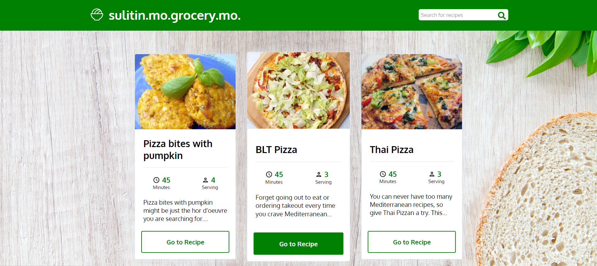

# SulitinMoGroceryMo

The SulitinMoGroceryMo application is a website for searching recipes. It aims to eliminate food waste by using every bit of your produce in your fridge. Users can use SulitinMoGroceryMo to find recipes with the ingredients they already have.

___Fun Fact___ SulitinMoGroceryMo is a Filipino phrase that basically means "make the most of your grocery".

Home page


## Setup and Installation

### Prerequisites

Please install the following if you have not already:

* Git
* Node.JS

### Cloning the repository
Click the "Code" (green) button and copy the HTTPS URL. Then navigate to your terminal and type the following, replacing the URL with your copied one.

```sh
$ git clone https://github.com/<"username">/<"repo-name">.git
```

### Navigating to the project directory

```sh
$ cd <repo-name>
```

### Installing dependencies

```sh
$ npm install
```

This command will install all the dependencies listed in the package.json.

### Starting the app

```sh
$ npm start
```

This will start the development server and run the React project on your web browser. Navigate to http://localhost:3000 to see the project.


## Technologies Used
* ReactJS
* JavaScript
* HTML/CSS
* Spoonacular API
* Visual Studio Code
* Github


